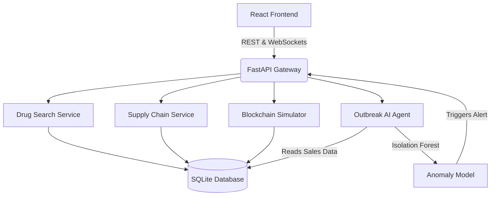

# 🏥 PharmaGuard AI

An intelligent drug supply & public health platform combining AI outbreak detection, simulated blockchain traceability, and location-aware drug search.

## 🌟 Key Features

1. **🧠 AI Outbreak Detection**
   - Detects disease outbreaks before they become crises by analyzing drug demand signals.
   - Uses Scikit-learn (Isolation Forest) to identify anomalies in regional sales data.
   - Triggers real-time WebSocket alerts to health authorities.
   - **Tech Stack:** Scikit-learn, APScheduler, WebSockets

2. **🔐 Blockchain Provenance Simulation**
   - Cryptographically linked simulated blockchain (SHA-256).
   - Verifies drug authenticity from Manufacturer → Distributor → Pharmacy.
   - Generates and scans QR codes for quick batch verification.
   - **Tech Stack:** Python hashlib, React QR Code

3. **💊 Intelligent Drug Search**
   - Find medicines, generic equivalents, and check real-time stock levels.
   - Location-based filtering (mocked distances).
   - **Tech Stack:** React, FastAPI

4. **📦 Supply Chain Analytics**
   - Interactive flow visualization tracking batches across the ecosystem.
   - **Tech Stack:** D3.js, React

## 🚀 Getting Started

### 1. Start the Backend

```bash
cd backend
python -m venv venv
venv\Scripts\activate  # Windows
# or source venv/bin/activate  # Linux/Mac
pip install -r requirements.txt

# Seed the database
python seed_data.py

# Run the FastAPI server
uvicorn app.main:app --reload
```

### 2. Start the Frontend

```bash
cd frontend
npm install
npm run dev
```

### 3. Open the App
Visit `http://localhost:5173` in your browser.

## 🏗️ Architecture Diagram



## 🛠️ Built With

- **Frontend:** React, Vite, Recharts, Leaflet, D3.js
- **Backend:** FastAPI, SQLite, SQLAlchemy, APScheduler
- **AI/ML:** Scikit-learn, Pandas, Numpy
